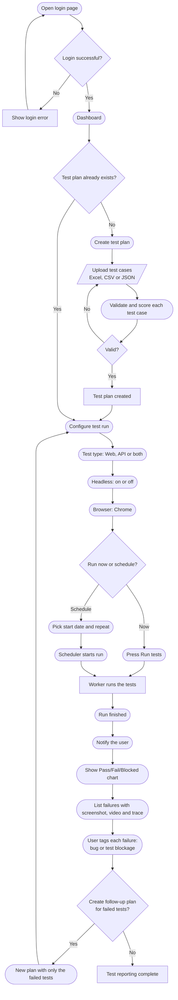

# Codeless Test Automation

A proof of concept for running automated browser and API tests without writing code.
Teams upload test cases as Excel, CSV or JSON, run them in Chrome with Playwright, and review the results.

## How it works



Scheduling and notifications are the next phase; everything else in the chart is built.
The full plan, with phases and safety rules, is in [docs/plan/codeless-flow.html](docs/plan/codeless-flow.html). Download it and open it in a browser.

## Setup

Requires Node.js 20 or newer and Google Chrome.

```bash
npm install
cp .env.example .env.local        # then fill in the values below
npx prisma migrate deploy
npm run db:seed                   # creates the QA Team and an admin user, and prints its password
npm run dev                       # web app on http://localhost:3001 plus the background test worker
```

`.env.local` needs:

| Variable | Purpose |
|---|---|
| `DATABASE_URL` | SQLite file, for example `file:./data/dev.db` |
| `SESSION_SECRET` | At least 32 random characters, for example from `openssl rand -base64 48` |
| `TYPESAFE_API_KEY` | Optional. Enables quality scoring and failure suggestions |
| `SEED_ADMIN_EMAIL`, `SEED_ADMIN_PASSWORD` | Optional. Choose the seeded admin's login |

## Everyday commands

| Command | What it does |
|---|---|
| `npm run dev` | Web app and worker together |
| `npm run user:create -- --username name --password '…'` | Add a team member (`--role ADMIN` for an admin) |
| `npm run tests:run -- --plan "Plan name"` | Run a saved plan from the terminal |
| `npm run check` | Type check, lint, end-to-end tests and the Jev code review |

## Project layout

| Folder | Contents |
|---|---|
| `src/app` | Next.js pages and server actions |
| `src/lib` | Data access, auth, the test case format and importers |
| `src/runner` | The Playwright runner that executes test steps |
| `scripts` | Worker, command-line runner, user and database helpers |
| `tests` | Playwright end-to-end and unit tests |
| `prisma` | Database schema and migrations |
